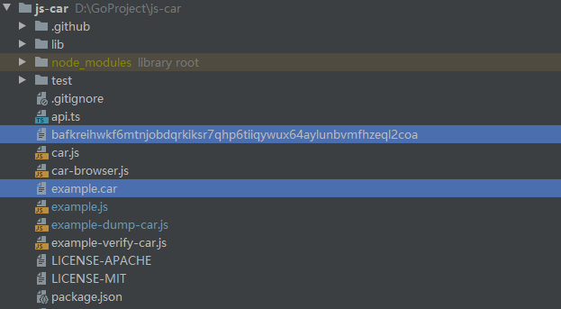

# **Filcoin 存储交易**

## 一、概念

- ### CAR

CAR全称（Content Addressable aRchives）内容可寻址系统，，`CAR 文件`通常用于存储序列化后的 DAG（有向无环图）数据结构，常用 .car 作为文件扩展名。CAR 是从 IPFS 体系中提炼总结出来的一种块数据层的数据规范。不是通过字符串标识符或URL来引用内容，而是通过密码哈希来引用内容。由于标识符未指定检索方法，因此可以完全分散内容，并且提供了一种验证内容的安全方法。

https://zhuanlan.zhihu.com/p/148312314

https://blog.csdn.net/yhc166188/article/details/93598247

https://github.com/ipld/go-car

https://github.com/ipld/js-car

- ### DAG

DAG(Directed Acyclic Graph)，中文名"有向无环图"。"有向"指的是有方向，准确的说应该是同一个方向，"无环"则指够不成闭环。区块链是一个去中心化的数据库，但是去中心化的数据库却不仅仅指区块链，因为还有一种技术叫做DAG,它也是分布式账本技术。在DAG中，没有区块的概念，他的组成单元是一笔笔的交易，每个单元记录的是单个用户的交易，这样就省去了打包出块的时间。验证手段则依赖于后一笔交易对前一笔交易的验证，换句话说，你要想进行一笔交易，就必须要验证前面的交易，具体验证几个交易，根据不同的规则来进行。这种验证手段，使得DAG可以异步并发的写入很多交易，并最终构成一种拓扑的树状结构，能够极大地提高扩展性。

https://blog.csdn.net/yhc166188/article/details/93598247

- ### IPLD

1. IPLD是基于内容寻址的数据模型的抽象层，IPLD能够连接起各类 以内容寻址为主的数据结构。设计IPLD的初衷是希望这一数据结构不 仅能应用于IPFS，而且能为其他通过哈希类型检索的数据提供一个通用 的数据模型。
2. IPLD实现跨系统和协议的引用，统一该类数据结构。
3. IPLD不是单个规范，而是一组规范。IPLD中的许多规范是相互依赖的。

## 二、存储数据

为了成功将数据添加到Filecoin网络中，需要成功完成以下步骤：

1. 数据必须打包到一个[CAR文件](https://github.com/ipld/specs/blob/master/block-layer/content-addressable-archives.md)。（见概念描述）
2. 矿工和客户之间的存储交易必须由矿工发起并接受。
3. 数据必须传输到矿工。
4. 矿工必须将数据放置在一个扇区中，封存数据并开始向网络提交证明。

至此，存储交易就在网络上上线了。

### 1、存入资料

将常规文件从当前系统导入到Lotus中，执行以下命令：

```shell
lotus client import ./your-example-file.txt
# 输出
Import 1, Root bafkqah3imvwgy3zmpfxxkiddmfxca5tjonuxiidcnbyg4zlufzuw6iik
```

成功后，此命令将返回`数据 CID`。该信息将用于进行交易以存储和检索数据。

您可以使用以下方式列出本地导入的文件的`数据CID`：

```shell
lotus client local
# 输出
1: bafkqah3imvwgy3zmpfxxkiddmfxca5tjonuxiidcnbyg4zlufzuw6iik @/root/your-example-file.txt (import)
```

如果您需要导入一个完整的文件夹或许多文件，最好先将它们压缩或压缩到单个存档中。

### 2、导入自定义DAG

IPLD高级用户可能希望将自定义的DAG导入Lotus中（如果不是，则可以跳过本小节）。

CAR文件格式允许序列化任何IPLD-DAG（即IPLD-CBOR）。自定义的IPLD-DAG应该用众所周知的格式（如CBOR）进行编码，否则Lotus将不知道如何解释它们。

> 警告
>
> CAR文件必须包含完整的DAG。不支持部分DAG！

如果您构建了自己的CAR文件，一定要用`--car`将其导入。

- #### 文件大于扇区

如果您的文件大于正在使用的[Filecoin网络](https://networks.filecoin.io/)的扇区，您需要先将文件分成多个部分。

存储矿工会指定他们提供的大小，这样你就可以选择最适合你的选项。较小的扇区速度较快，而较大的扇区则更具成本效益。

### 3、进行存储交易

一旦知道了`数据CID`，就可以用它与矿工进行存储交易。

#### 3.1 寻找一个矿工

- 您可以通过以下方式获取网络中所有矿工的列表：

```shell
lotus state list-miners
t0xxxx
t0xxxy
t0xxxz
...
```

- 也可以把矿工列表导出成文件

```shell
lotus state list-miners > miner.log
```

#### 3.2 查询价格和条件

> 注意说明
>
> 询问价格需该矿工已提供交易清单

为了询问特定矿工提供的条款，您可以运行：

```shell
lotus client query-ask <miner>
```

以RRM的矿工号：f09652为例进行查询，如果出现以下情况，可能是该矿工没有提供交易清单

```shell
lotus client query-ask f09652

ERROR: failed to open stream to miner: exhausted 5 attempts but failed to open stream, err: failed to dial 12D3KooWAAap3GmuBww6k7oYMLvQeoVVstVFmQaLqThfM9ZFtDqT: all dials failed
  * [/ip4/170.33.9.50/tcp/32632] dial tcp4 0.0.0.0:39025->170.33.9.50:32632: i/o timeout
```

您可以访问以下任意链接寻找可以交易的矿工

```shell script
https://slate.host/_?scene=V1_NAVIGATION_ARCHIVE
https://ipfs.io/ipfs/QmWimpGA6ZnPxMi35gyk8RtA6dFo3tQSemspavZjG7s9Qa/
```

输入对应矿工号询问价格

```shell
lotus client query-ask f07819

Ask: f07819
Price per GiB: 0.00000001 FIL
Verified Price per GiB: 0.000000005 FIL
Max Piece size: 32 GiB

lotus client query-ask f025007

Ask: f025007
# 表示每GiB的价格
Price per GiB: 0.0000001 FIL
# 每GiB的验证价格
Verified Price per GiB: 0.0000001 FIL
# 最大容量
Max Piece size: 32 GiB
```

#### 3.3 达成交易

对条款满意后，您就可以使用导入过程中获得的数据CID向矿工提出交易。执行：

```shell
lotus client deal
```

该命令将以交互方式询问您交易的CID，矿工ID和持续时间（以天为单位）。您也可以用参数来调用它：

```shell
lotus client deal <data CID> <miner> <price> <duration>
```

其中，持续时间以块:duration为单位（1个块相当于30s）。

> 注意说明
>
> 考虑到lotus网络当前的速度和稳定性，存在与矿工的个体交易意外失败的情况。因此，建议每个[CAR文件](https://github.com/ipld/specs/blob/master/block-layer/content-addressable-archives.md)最多进行10笔交易。官方称这是增加成功交易和存储数据的机会的简单方法。随着网络的成熟，这种解决方法可以不使用。

#### 3.4 检查交易状态

您可以列出以下交易：

```shell
lotus client list-deals
```

其中，此命令会提供关于你的交易的当前状态的信息，它们是否已经在链上发布（由矿工发布），以及矿工是否因不履行交易而被削减。

为了使交易成功，矿工需要正确配置和运行，接受交易并正确密封文件。否则，交易将显示为错误状态。

你可以把同一数据与多个矿工进行交易存储。

一旦交易成功，数据被封存，就可以通过以下方式进行[检索](https://docs.filecoin.io/store/lotus/retrieve-data/)。

## 三、检索数据

本指南将告诉你如何使用Lotus来检索存储在Filecoin网络上的数据。

数据检索是通过与检索矿工达成检索协议来实现的。在这个协议中，客户同意为给定的数据向矿工支付一定的金额。这种支付是随着数据的接收，利用支付通道逐步发生的。与存储交易不同，检索交易发生在链外。

目前，Lotus支持原存储数据的存储矿工直接检索，不过，按照网络的规范，计划支持专门从事该业务的独立检索矿工，让检索成为高效、快速、可靠的操作。届时，客户将能够在网络上搜索到所有可能的所需数据提供商（通过DHT、链上或带外聚合器），比较交易条款，并根据自己的需求选择最佳的检索方案。

### 1、检索数据

为了检索某些数据，您将需要用于创建存储交易的数据CID。

您实际上可以查询客户端，以使用以下方式为您提供所有已知存储某些数据的矿工：

```shell
lotus client find <Data CID>
```

### 2、检索交易

该命令可简化检索交易过程

```shell
lotus client retrieve --miner <miner ID> <Data CID> <outfile>
```

此命令采用其他可选标志（选中--help）。

如果输出文件不存在，它将在Lotus存储库目录中创建。此过程可能需要2到10分钟。

## 四、Car格式文件存取

克隆项目到本地，切换其最新tag

```shell
git clone https://github.com/ipld/js-car
```

案例介绍

- 直接运行以下命令会将一段文本内容创建成一个`example.car`的文件，文件中包含一个区块，并以该区块的CID作为单根。并在控制台输出其文本内容和`CID`。

```shell
node example.js

(node:28380) ExperimentalWarning: The ESM module loader is experimental.
Retrieved [random meaningless bytes] from example.car with CID [bafkreihwkf6mtnjobdqrkiksr7qhp6tiiqywux64aylunbvmfhzeql2coa]
```

- 指定car文件运行命令，会将其内容转存到一个文件中，文件名是其`CID`。并且把该块的DAG-JSON和CID输出到控制台

```shell
node example-dump-car.js example.car

(node:9532) ExperimentalWarning: The ESM module loader is experimental.
bafkreihwkf6mtnjobdqrkiksr7qhp6tiiqywux64aylunbvmfhzeql2coa [raw]
'{"0":114,"1":97,"10":110,"11":105,"12":110,"13":103,"14":108,"15":101,"16":115,"17":115,"18":32,"19":98,"2":110,"20":121,"21":116,"22":101,"23":115,"3":100,"4":111,"5":109,"6":32,"7":109,"8":101,"9":97}'
```



- 验证文件有效性(没报错情况下证明其文件没有被篡改，输出`.`表示正确)

```shell
node example-verify-car.js example.car

(node:19024) ExperimentalWarning: The ESM module loader is experimental.
.
```

## 参考链接

https://docs.filecoin.io/store/lotus/store-data/#overview

https://blog.csdn.net/kk3909/article/details/104815717

https://docs.filecoin.io/store/lotus/retrieve-data/
